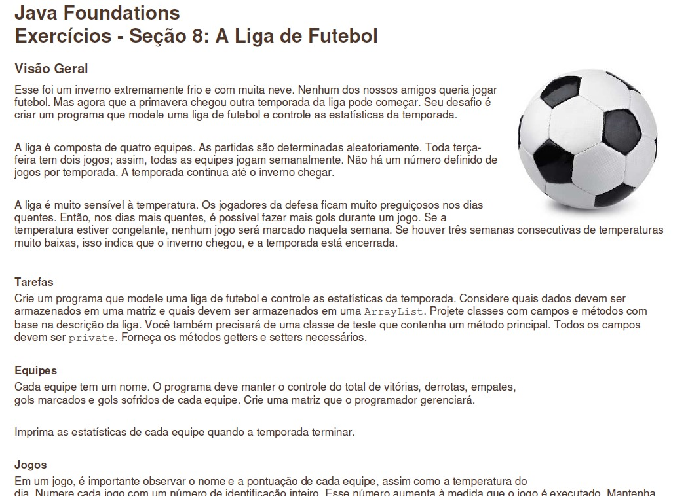
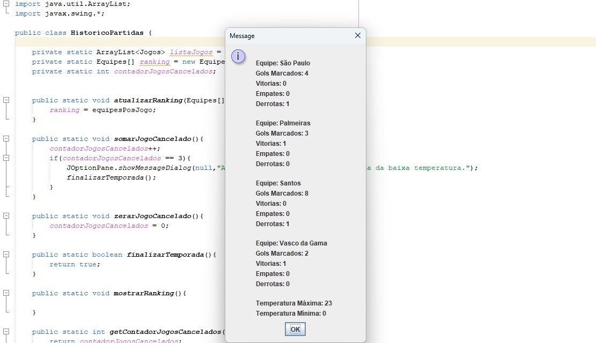
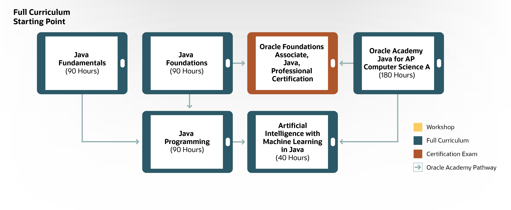

# A Liga de Futebol

Projeto desenvolvido durante o curso *Java Foundations* oferecido pela **ORACLE** cursado em ***Junho/2024***

## OBJETIVO DO PROJETO

O objetivo era aplicar os conhecimentos adquiridos durante o curso através do desenvolvimento de um sistema que simula uma liga de Futebol. As tarefas do projeto foram passadas em um arquivo PDF com as instruções do que deveria ser feito, mas não como seria feito. Essa foi uma ótima oportunidade pra aprimorar a habilidade de interpretar o que foi pedido e passar para o código.

#### EXEMPLO

### REQUISITOS

* A liga precisa ser composta por 4 equipes
* Os integrantes e resultado das partidas são gerados de forma aleatória
* Todo início de jogo é lido o valor da temperatura
* Se estiver muito frio, não há jogo
* Quanto mais alta a temperatura, maior a quantidade possível de gols
* Se houver 3 semanas jogos, a temporada acaba e o programa exibe as estatísticas da temporada

## BIBLIOTECA UTILIZADA

* Java Swing

*Java Swing* é um biblioteca de interface gráfica de usuário. Foi meu primeiro contato com *Java e Interface Gráfica*. 

## SOBRE O JAVA FOUNDATIONS

O *Java Foundations* é o segundo curso na lista de cursos de Java oferecidos pela **ORACLE**. Este é o curso preparatório para o Exame de Certificação Profissional.

[Mais informações sobre o Java Foundations](https://academy.oracle.com/pt-br/solutions-curriculum-java.html#java2-tab)

